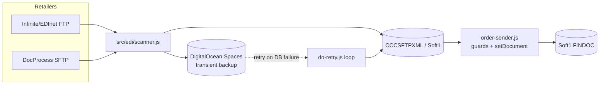

# EDI pipeline architecture (scanner, providers, transports, DO storage)

General architecture of the inbound/outbound EDI pipeline that all retailer document flows
(orders, invoices, APERAK, RECADV) run through. For the RECADV-specific feature see
[recadv-pipeline.md](recadv-pipeline.md); for the reception screen UI see
[reception-screen.md](reception-screen.md).

## Overview

Two retailer integration families, one pipeline:
- **Infinite/EDInet** (Auchan, Dedeman) — FTP, shared account, directories per doc type
  (`/orders`, `/recadv`, `/retann`; APERAK never fetched from here).
- **DocProcess** (Carrefour, Kaufland, Metro, Mega Image, Supeco, …) — SFTP, **one shared inbox**
  per company for both `ORDERS_*` and `APERAK_*` filenames — routing must disambiguate by content,
  not just by which config triggered the fetch.

## Key modules

- `src/edi/scanner.js` — orchestrator, single concurrency lock. Per active `CCCSFTP` config:
  lists remote files, downloads, backs up to DO, dedupes (`CCCSFTPXML.find({XMLFILENAME})`,
  filename-only, no retailer scope), inserts as `CCCSFTPXML` rows, then deletes the DO object once
  the DB insert succeeds. Also resolves DocProcess routing (see below) and writes one heartbeat
  row to `orders-log` per pass (`OPERATION='system'`, counters).
- `src/edi/providers/{infinite,docprocess}.provider.js` + `provider.interface.js` — per-source
  contract: `docTypes` (which doc types this provider fetches — **the only gate**, can be a getter
  for env-flag-controlled features), `filenamePrefixes(docType, cccsftpRow)` (`[]` = no filter,
  safe **only** when the doc type has its own `remoteSubdir`; DocProcess shares one inbox and must
  always return a real prefix — enforced by `test/edi/provider-contract.test.js`), `remoteSubdir`,
  and a `parse*` function per doc type (`parseOrder`, `parseAperak` on DocProcess only, `parseRecadv`
  on Infinite only — RECADV can never reach `CCCAPERAK` because `infiniteProvider` has no
  `parseAperak`).
- `src/edi/transports/{ftp,sftp}-transport.js` + `factory.js` + `safe-host.js` — thin transport
  abstraction (list/get/connect) so the scanner doesn't know FTP vs SFTP details. `safe-host.js`
  validates the configured host before connecting.
- `src/edi/order-builder.js` — `buildOrderPayload()`: turns parsed XML + `CCCXMLS1MAPPINGS` rows
  into a Soft1 JSON order object via parameterized `{value}` substitution (`runMappingSql`).
- `src/edi/order-sender.js` — `sendOrderToS1()`, status machine `NEW -> PROCESSING -> SENT|ERROR`,
  plus a **guard chain** run before `setDocument`: `duplicateGuard` (existing active order by
  `TRDR+NUM04+SOSOURCE=1351+FPRMS=701+ISCANCEL=0` -> patch to `SENT` with the existing `FINDOC`,
  skip creation) then `pastDeliveryGuard` (delivery date before today Europe/Bucharest -> hold as
  `XMLSTATUS='MANUAL'`, bypassed by an explicit `manual:true` resend). **Any future "hold instead
  of create" business rule belongs in this guard chain**, right after `pastDeliveryGuard`.
- `src/edi/do-retry.js` — retry loop (`DO_RETRY_INTERVAL_MS`, default 5 min) for objects that
  failed the `CCCSFTPXML` insert. Branches **per doctype** (`ORDERS` / `APERAK` / `RECADV`) —
  anything without a branch is skipped and stays parked in DO forever, so every new doctype needs
  one added here.
- `src/edi/sign-smime.js` — S/MIME signing helper for outbound XML where required.
- `src/edi/text-sanitize.js` — `sanitizeForS1()`; see
  [soft1-text-encoding-mojibake.md](soft1-text-encoding-mojibake.md).
- `src/edi/scanner-flags.js` — env-driven feature flags (`ENABLE_SFTP_SCANNER`, `EDI_SCANNER`,
  `EDI_ENABLE_RECADV`, `EDI_DOWNLOAD_AGE_DAYS`, `DO_RETRY_INTERVAL_MS`), read live (getters), not
  cached at startup — flipping a Heroku config var is a genuine live change, no deploy needed.

## DocProcess shared-inbox routing

DocProcess retailers all download from the same `ORDERS_`/`APERAK_` prefixed inbox regardless of
which `CCCSFTP` config triggered the scan, so the scanner must resolve the **real** retailer from
the XML content itself, not from the config that fetched it:
- Orders: parse buyer `GLN` from the XML, look up `TRDBRANCH.CCCS1DXGLN` among active DocProcess
  retailers. If parsing/lookup fails or is ambiguous, **fail closed**: insert as `CCCSFTPXML` with
  `TRDR_RETAILER=0`, `XMLSTATUS='ERROR'`, `XMLERROR='DocProcess routing error...'`, and rich routing
  context in `JSONDATA.routing` — never guess and insert under the fetching config's retailer.
  UI: `/app/routing-errors` (`Erori rutare`), `CCCSFTPXML.resolveRouting(id)` re-resolves after the
  GLN is fixed in S1.
- APERAK responses are stored directly into `CCCAPERAK` (not `CCCSFTPXML`), linked to the invoice
  `FINDOC` by `FINCODE`; see the resolved incident below for the date-column bug that broke this.
- A **shared-directory guard** in the scanner prevents listing the same physical directory twice
  per cycle when two provider configs point at it (bug found during RECADV rollout — see
  [recadv-pipeline.md](recadv-pipeline.md)).

## Status machine (`CCCSFTPXML.XMLSTATUS`)

`NEW -> PROCESSING -> SENT | ERROR | MANUAL`. RECADV rows use a distinct terminal status,
`INGESTED` (never converted to a Soft1 document) — `processPendingOrders` explicitly filters
`doctype:'ORDERS'` so RECADV rows are never picked up by the order processor.

## Testing conventions

- `test/edi/ftp-server.js` / SFTP harness serve **the entire tree** under
  `test/edi/fixtures/infinite/**` and `test/edi/fixtures/docprocess/**` to `scanner.test.js`'s
  integration suite, which asserts **exact** file/download counts.
- **Any fixture meant only for a direct unit-test read (`fs.readFile`), not the scanner
  integration test, must live outside those two trees** (e.g. `test/edi/fixtures/mapping-errors/`,
  `test/edi/fixtures/recadv/`) or it silently inflates the integration counts and breaks unrelated
  tests.

## Resolved incidents (do not re-diagnose)

- **APERAK DO-retry stuck objects (2026-06-11).** Two independent bugs: (1) AJS `createAperak`
  bound date/time values as raw strings into `DATE`/`TIME` columns (`ntext incompatible with
  date`) — fixed with `CAST(:n AS VARCHAR)` + `TRY_CONVERT` in the `INSERT`, plus
  `OUTPUT INSERTED.CCCAPERAK` to get the real PK (`SCOPE_IDENTITY()` was running on a different
  connection than `X.RUNSQL` and returned 0). (2) `do-retry.js` only handled
  `doctype==='ORDERS'` and silently skipped APERAK objects forever — fixed by adding
  `retryAperakObject`. Both needed fixing together; fixing only the AJS left objects parked in DO
  with stale historical error metadata until reprocessed.
- **Legacy cutover (2026-06-09).** `retailers1` ran the legacy scanner; `retailers4` runs this
  pipeline (`ENABLE_SFTP_SCANNER=true`, `EDI_SCANNER=new`). A same-day cutover attempt was rolled
  back after `retailers4` tried to insert `ORDERS_*.pdf` as XML — fixed by requiring `.xml`/
  `.confirm` extensions after prefix matching (later relaxed for `recadv`/`retann`, see
  [recadv-pipeline.md](recadv-pipeline.md)). Re-attempted and held since.
- **`retailers4` auto-builds from its connected git branch (currently
  `feat/edi-safety-sftp-tests`) via Heroku's GitHub integration.** Do NOT `git push retailers4` —
  that double-builds the same commit and Heroku warns about it. `git push origin <branch>` is
  enough.

## See also
- [recadv-pipeline.md](recadv-pipeline.md) — RECADV feature built on top of this pipeline.
- [soft1-schema-facts.md](soft1-schema-facts.md) — Soft1-side schema this pipeline writes into.
- [security-secrets.md](security-secrets.md) — credentials handling, rotation status.
