# EDInet Connector – manual

## Table of contents

EDInet Connector – manual....1

Installation....1

Orders relation ....3

Retanns relation ......5

Invoices relations ....5

## Installation

1. Please download EC from here: http://www.infinite.pl/pub/soft/edinetconnector/  
File: EdinetConnector-1.6.exe  
You need the latest java library.  
2. Start installation process with EdinetConnector-1.6.exe  
3. Chose language and click Next

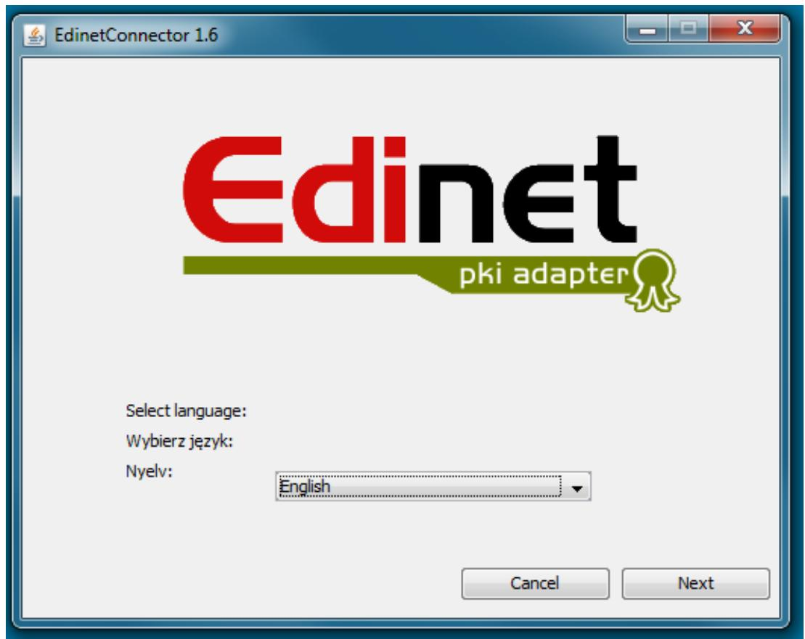

text_image

EdinetConnector 1.6
Edinet
pki adapter
Select language:
Wybierz język:
Nyelv:
English
Cancel	Next

4. Accept the agreement  
5. Please implement License key.
You got the License from Edinet helpdesk

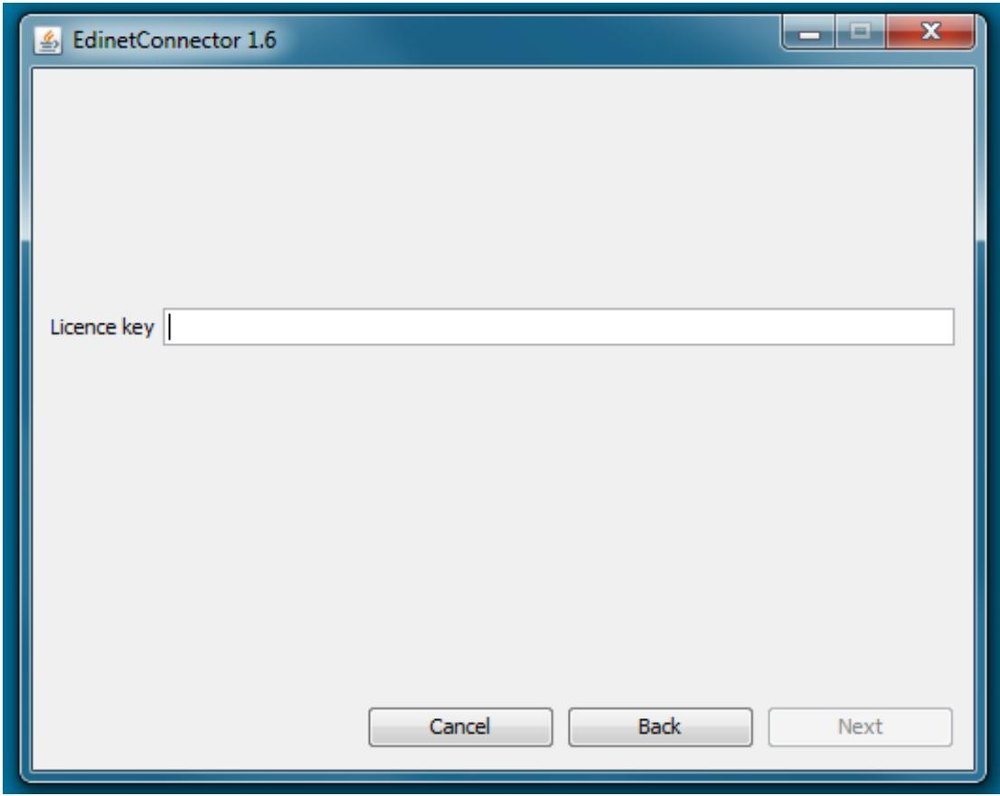

text_image

EdinetConnector 1.6
Licence key
Cancel	Back	Next

6. Click install  
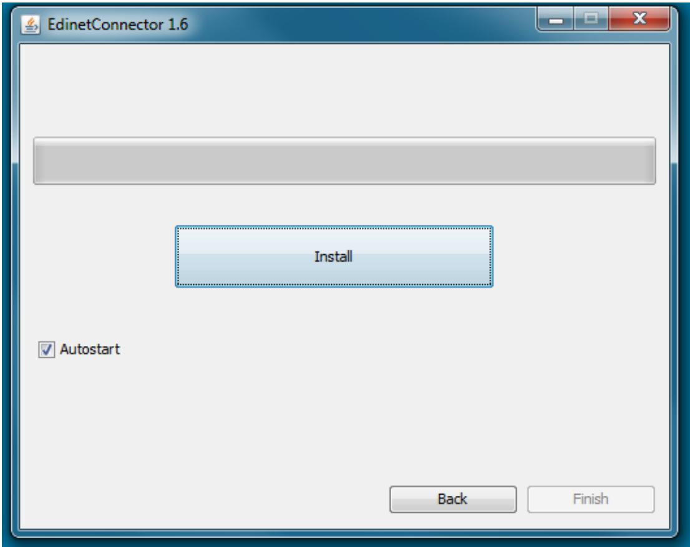

text_image

EdinetConnector 1.6
Install
Autostart
Back	Finish

7. Start and open EDInet Connector from tray

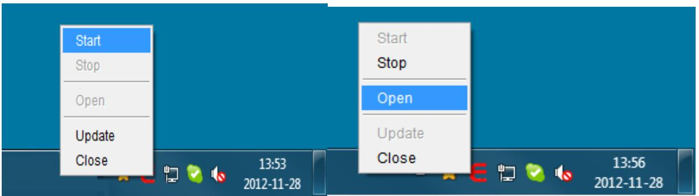

text_image

Start
Stop
Open
Update
Close
13:53
2012-11-28
Start
Stop
Open
Update
Close
13:56
2012-11-28

8. Type login and password (admin/admin).

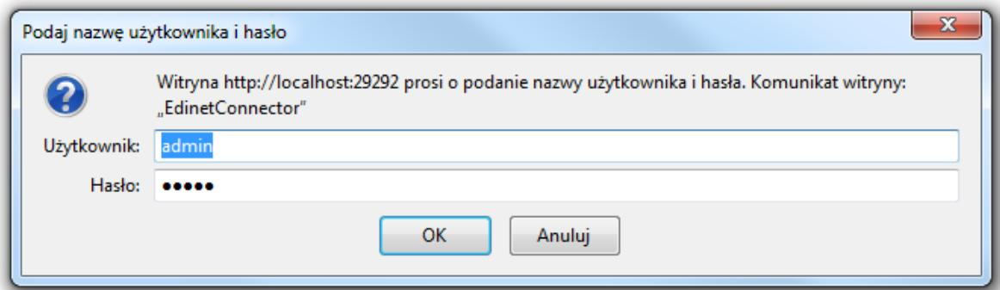

text_image

Podaj nazwę użytkownika i hasło
Witryna http://localhost:29292 prosi o podanie nazwy użytkownika i hasła. Komunikat witryny:
„EdinetConnector"
Użytkownik: admin
Hasło: •••••
OK	Anuluj

### Orders relation

1. Proceed to RELATIONS bookmark and Add new relation.

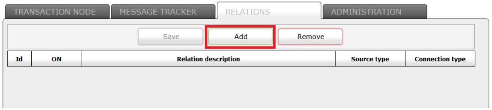

flowchart

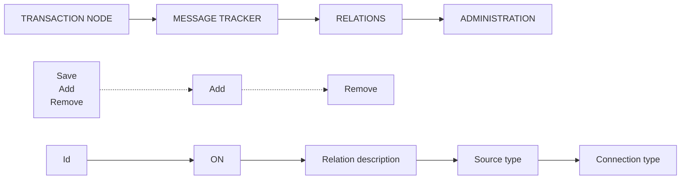

2. You can create few types of relations: DIRECTORY to DIRECTORY, FTP to FTP, DIRECTORY to FTP or FTP to DIRECTORY.

Please select: FTP -> Directory

Also type name of relation.

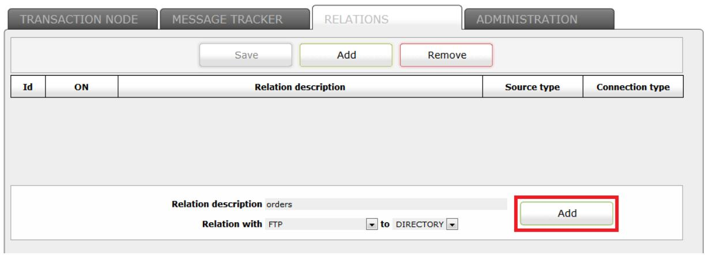

flowchart

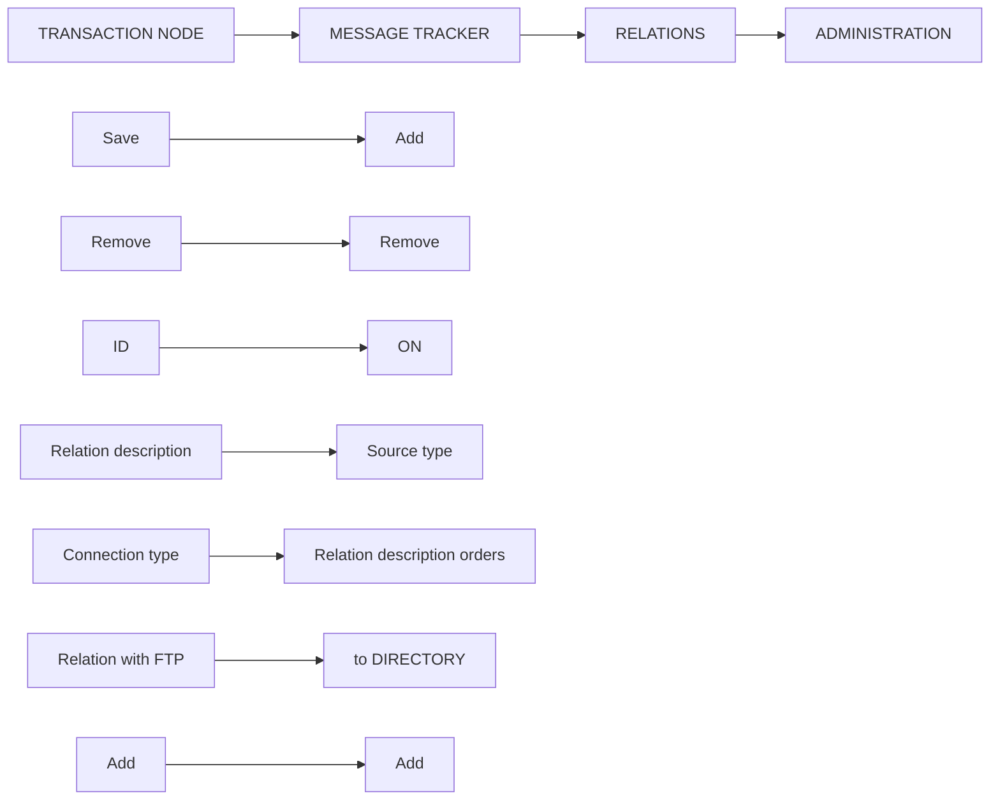

3. Enter the source settings:

You got those data from Edinet helpdesk.

Host name: ftp.infinite.pl

Remote directory: /orders/

### Port: 21

User name and password are different for every client.

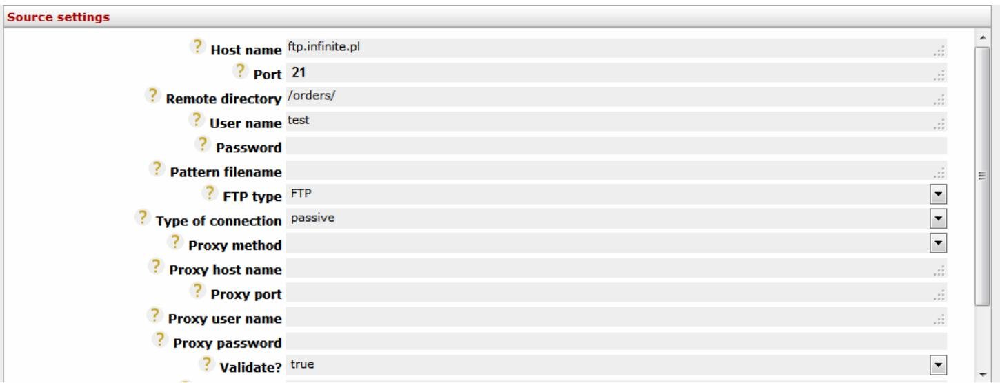

text_image

Source settings
? Host name ftp.infinite.pl
? Port 21
? Remote directory /orders/
? User name test
? Password
? Pattern filename
? FTP type FTP
? Type of connection passive
? Proxy method
? Proxy host name
? Proxy port
? Proxy user name
? Proxy password
? Validate? true

#### 4. Check the connection:

text_image

Check connection
Success

5. Enter the destination settings. Where orders will be downloading to your system.

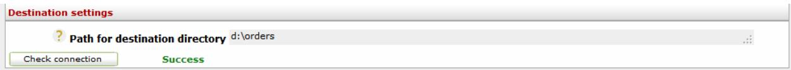

text_image

Destination settings
? Path for destination directory d:\orders
Check connection Success

#### 6. Save the relation

flowchart

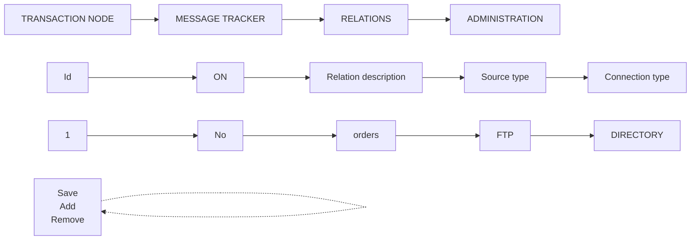

7. To launch the EDInet Connector go to TRANSACTION MODE and press start or start all button. Order will be downloading from Edinet system to your server

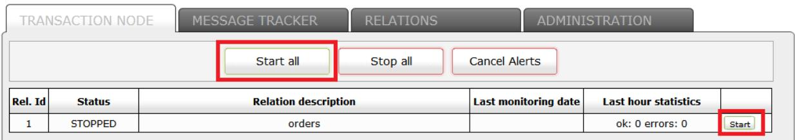

flowchart

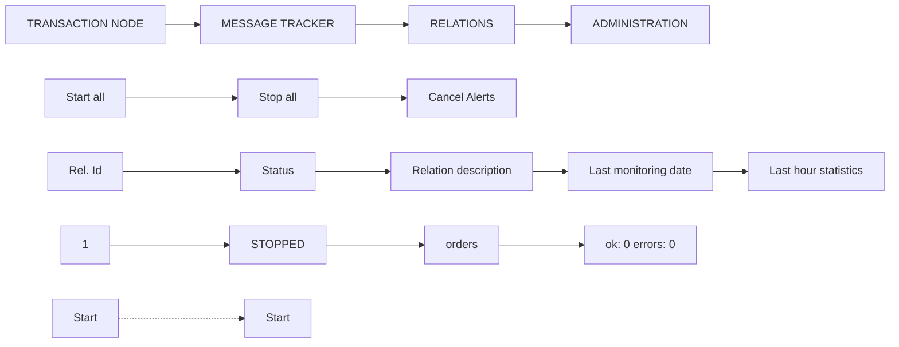

8. To check the document status, please go to MESSAGE TRACKER bookmark.

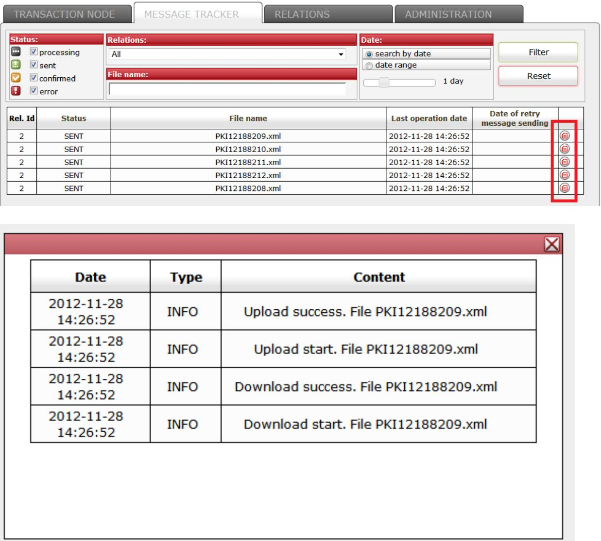

TRANSACTION NODE

MESSAGE TRACKER

RELATIONS

ADMINISTRATION

<table><tr><td>Status:</td><td>Relations:</td><td>Date:</td></tr><tr><td>processing</td><td>All</td><td></td></tr><tr><td>sent</td><td></td><td>search by date</td></tr><tr><td>confirmed</td><td>File name:</td><td>date range</td></tr><tr><td>error</td><td></td><td>1 day</td></tr></table>

<table><tr><td>Rel. Id</td><td>Status</td><td>File name</td><td>Last operation date</td><td>Date of retry message sending</td><td></td></tr><tr><td>2</td><td>SENT</td><td>PKI12188209.xml</td><td>2012-11-28 14:26:52</td><td></td><td></td></tr><tr><td>2</td><td>SENT</td><td>PKI12188210.xml</td><td>2012-11-28 14:26:52</td><td></td><td></td></tr><tr><td>2</td><td>SENT</td><td>PKI12188211.xml</td><td>2012-11-28 14:26:52</td><td></td><td></td></tr><tr><td>2</td><td>SENT</td><td>PKI12188212.xml</td><td>2012-11-28 14:26:52</td><td></td><td></td></tr><tr><td>2</td><td>SENT</td><td>PKI12188208.xml</td><td>2012-11-28 14:26:52</td><td></td><td></td></tr></table>

<table><tr><td>Date</td><td>Type</td><td>Content</td></tr><tr><td>2012-11-28 14:26:52</td><td>INFO</td><td>Upload success. File PKI12188209.xml</td></tr><tr><td>2012-11-28 14:26:52</td><td>INFO</td><td>Upload start. File PKI12188209.xml</td></tr><tr><td>2012-11-28 14:26:52</td><td>INFO</td><td>Download success. File PKI12188209.xml</td></tr><tr><td>2012-11-28 14:26:52</td><td>INFO</td><td>Download start. File PKI12188209.xml</td></tr></table>

### Retanns relation

Configuration is the same like for orders.

Only remote directory is different.

The source settings:

You got those data from Edinet helpdesk.

Host name: ftp.infinite.pl

Remote directory: /retanns/

Port: 21

User name and password are different for every client.

### Invoices relations

1. Proceed to RELATIONS bookmark and Add new relation.

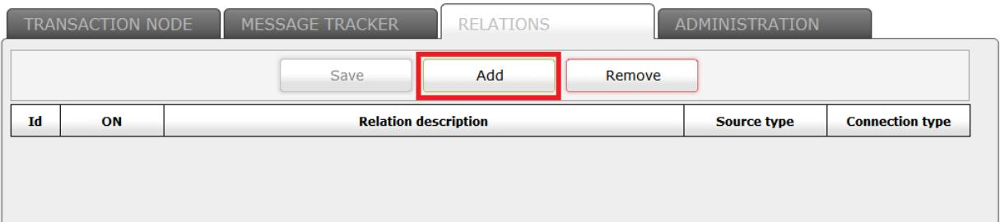

flowchart

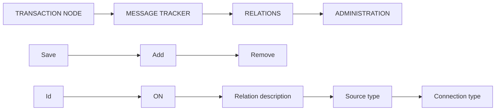

2. You can create few types of relations: DIRECTORY to DIRECTORY, FTP to FTP, DIRECTORY to FTP or FTP to DIRECTORY.

#### Please select: Directory -> FTP

Also type name of relation.

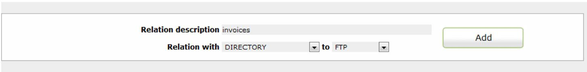

text_image

Relation description invoices
Relation with DIRECTORY to FTP
Add

### 3. Main setting:

3.1 Signature type: please select Key storage  
3.2 Path to key store: type the path where you put Edinet key (you got from Edinet helpdesk, file edinet.p12)  
3.3 Enter the password  
3.4 Click on Certificate list, select certificate and click OK.  
3.5 The rest stays in default.

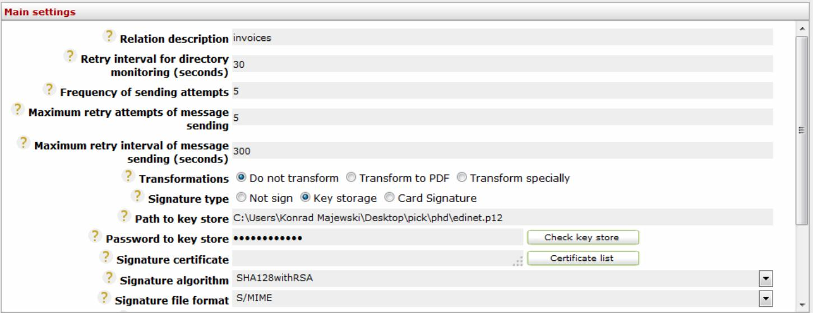

text_image

Main settings
? Relation description invoices
? Retry interval for directory monitoring (seconds) 30
? Frequency of sending attempts 5
? Maximum retry attempts of message sending 5
? Maximum retry interval of message sending (seconds) 300
? Transformations Do not transform Transform to PDF Transform specially
? Signature type Not sign Key storage Card Signature
? Path to key store C:\Users\Konrad Majewski\Desktop\pick\phd\edinet.p12
? Password to key store Check key store
? Signature certificate Certificate list
? Signature algorithm SHA128withRSA
? Signature file format S/MIME

#### 4. Enter the source settings:

The place where invoices are imported from your ERP system.

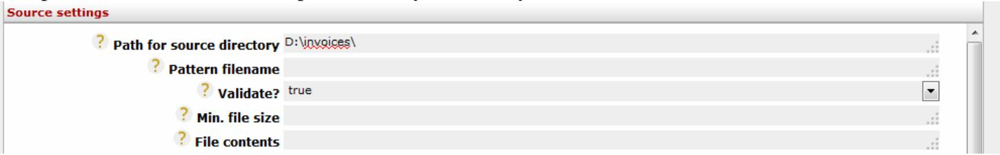

text_image

Source settings
? Path for source directory D:\invoices\
? Pattern filename
? Validate? true
? Min. file size
? File contents

#### 5. Enter the destination settings.

#### You got those data from Edinet helpdesk.

Host name: ftp.infinite.pl

Remote directory: /invoice/

Port: 21

User name and password are different for every client.

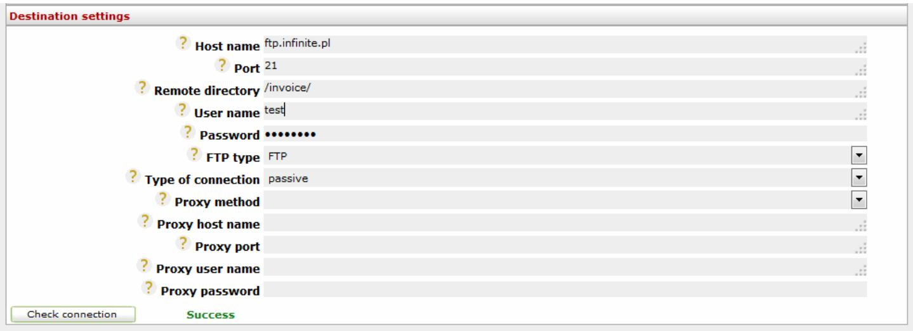

text_image

Destination settings
? Host name ftp.infinite.pl
? Port 21
? Remote directory /invoice/
? User name test
? Password ••••••••
? FTP type FTP
? Type of connection passive
? Proxy method
? Proxy host name
? Proxy port
? Proxy user name
? Proxy password
Check connection Success

#### 6. Check the connection:

text_image

Check connection
Success

#### 7. Save the relation

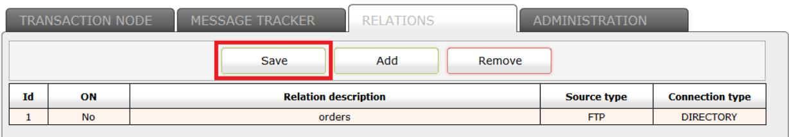

flowchart

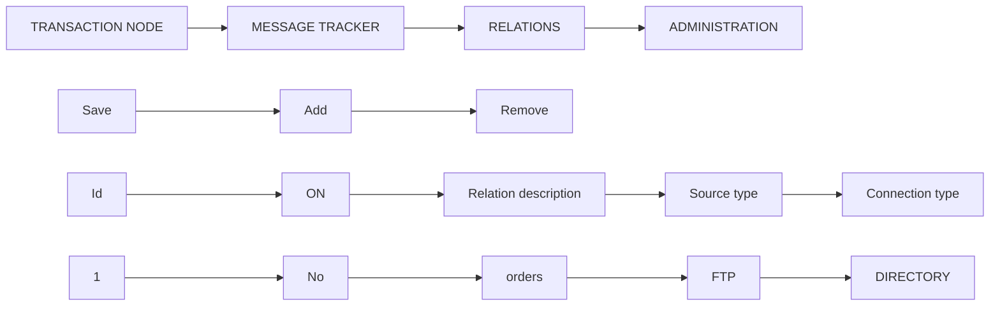

8. To launch the EDInet Connector go to TRANSACTION MODE and press start or start all button. Invoices will be sending to Edinet system.

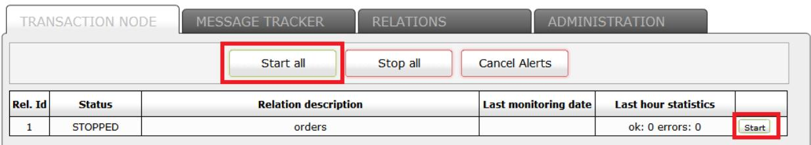

flowchart

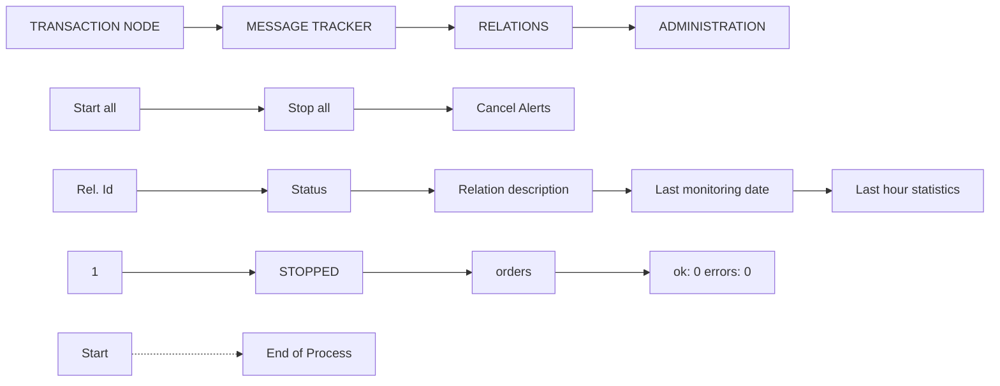

9. To check the document status, please go to MESSAGE TRACKER bookmark.

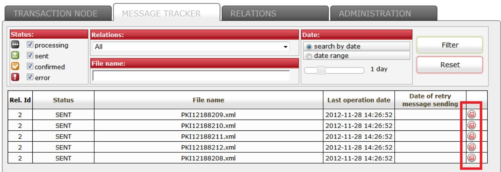

text_image

TRANSACTION NODE
MESSAGE TRACKER
RELATIONS
ADMINISTRATION
Status:
processing
sent
confirmed
error
Relations:
All
File name:
Date:
search by date
date range
1 day
Filter
Reset
Rel. Id	Status	File name	Last operation date	Data of retry
message sending
2	SENT	PKI12188209.xml	2012-11-28 14:26:52			①
2	SENT	PKI12188210.xml	2012-11-28 14:26:52			①
2	SENT	PKI12188211.xml	2012-11-28 14:26:52			①
2	SENT	PKI12188212.xml	2012-11-28 14:26:52			①
2	SENT	PKI12188208.xml	2012-11-28 14:26:52			①

