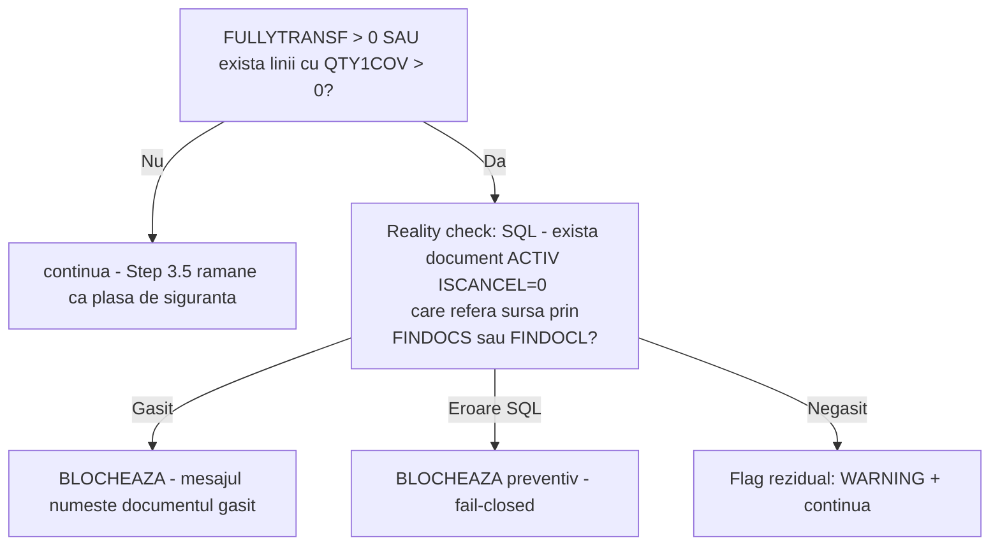

# Mecanismul FULLYTRANSF și garda de conversie repetată în MultiRetur

## Context și problemă

`MultiRetur.js` creează automat un document de retur (aviz/factură) pornind de la un document
sursă (`idFacturaS1`), legând liniile noi de liniile sursă prin `ITELINES.FINDOCS` /
`ITELINES.FINDOCL`. Implementarea inițială valida doar existența unui document de
retur/storno activ deja legat de sursă (`FINDOCS`/`FINDOCL`), fără să țină cont de mecanismul
nativ SoftOne de marcare a conversiei (`FINDOC.FULLYTRANSF` / `MTRLINES.QTY1COV`). Rezultatul:
era posibilă conversia unui document sursă într-un **al doilea** aviz de retur, deși operarea
manuală directă în S1 ar fi fost oprită de flagul nativ `FULLYTRANSF`.

Scopul acestei intervenții: API-ul trebuie să se comporte la fel ca S1 în UI — să blocheze o a
doua conversie a aceluiași document sursă.

## Mecanismul nativ SoftOne de urmărire a conversiei

Când liniile unui document nou primesc `FINDOCS`/`FINDOCL` către un document sursă, motorul
nativ S1 (ExtraUpdates) actualizează automat, pe documentul **sursă**:

- **`FINDOC.FULLYTRANSF`** — flag la nivel de antet (Smallint, readOnly, editor `$TransState`,
  default `0`), expus și pe obiectul `SALDOC` ca `SALDOC.FULLYTRANSF`.
- **`MTRLINES.QTY1COV`** — cantitate deja acoperită de o conversie ulterioară, la nivel de
  linie (`ITELINES`/`SRVLINES`). Câmpuri asociate: `QTY1CANC`, `QTY1FCOV` (nu se folosesc aici).

Nu este nevoie ca acest flag să fie scris manual prin SQL — s-a verificat empiric că motorul S1
îl actualizează singur, inclusiv pentru retururile create prin `MultiRetur` (14 din 15 retururi
recente au lăsat corect sursa la `FULLYTRANSF=1` cu `QTY1COV=QTY1` pe toate liniile). **Nu se
scrie niciodată manual `FULLYTRANSF`/`QTY1COV` — S1 își gestionează singur această bookkeeping.**

### Valori observate pentru `FULLYTRANSF`

| Valoare | Semnificație |
|---|---|
| `0` | Neconvertit |
| `1` | Convertit total |
| `2` | Convertit parțial |
| `3` | Stare istorică pe documente vechi/anulate |

### Criteriu de business

**Nu se acceptă conversii parțiale** (cel puțin deocamdată). Prin urmare orice valoare diferită
de `0` — inclusiv conversia parțială (`2`) — este tratată ca **"deja convertit total"** și
blochează o nouă conversie.

### Capcană: anularea nu resetează flagul

Anularea (`ISCANCEL=1`) unui document rezultat dintr-o conversie **NU** resetează
`FULLYTRANSF` pe sursă. Exemplu verificat: dintre avizele ale căror singure retururi (serie
`9221`) sunt anulate, **60** au rămas cu `FULLYTRANSF=1` și doar **1** cu `0`. Dacă am fi blocat
strict pe baza flagului nativ (paritate strictă cu S1), aceste 60 de avize ar fi rămas blocate
definitiv chiar și după anularea returului greșit — comportament identic cu S1 manual, dar prea
rigid pentru un API automatizat.

## Soluția implementată

### Locație

Funcția `MultiRetur_evaluateConversionGuard(...)` din [`MultiRetur.js`](../../MultiRetur.js),
apelată din `processMultiRetur` la pasul **Step 3.4** (imediat după extragerea liniilor
`ITELINES`/`SRVLINES`, înainte de Step 3.5 — verificarea existentă a lanțului de
retur/storno prin `FINDOCS`/`FINDOCL`, păstrată neschimbată ca plasă de siguranță suplimentară
pentru date istorice "murdare").

Funcția a fost extrasă ca funcție de sine stătătoare (fără dependențe directe de `X`/`ctx`/
`PF_ApiCommons`) tocmai ca să poată fi testată izolat, cu date mock — vezi
[`tests/MultiRetur.guard.test.js`](../../tests/MultiRetur.guard.test.js).

```javascript
function MultiRetur_evaluateConversionGuard(
    idFacturaS1, originalFincode, originalFullyTransf,
    allLinesForCoverage, sqlExecutor, logFn
) { ... }
```

- `sqlExecutor` — injectat; în producție `function (sql) { return X.SQL(sql); }`, în teste un
  mock care nu atinge baza de date.
- `logFn` — injectat; în producție `function (message, data) { PF_ApiCommons.log(ctx, message, data); }`.
- Returnează `{ action, fullyTransfValue, alreadyCoveredLines, errorMessage, warningMessage, derived }`,
  unde `action` este una din: `'continue'`, `'block'`, `'residual'`.

### Logica: "reality check" în loc de paritate strictă

Varianta de paritate strictă cu S1 (blocare necondiționată pe orice `FULLYTRANSF != 0`) a fost
respinsă ca fiind prea rigidă, tocmai din cauza capcanei descrise mai sus (anularea nu resetează
flagul). Soluția aleasă verifică dacă flagul mai este **susținut de realitate**: există sau nu un
document activ care încă referă sursa?



1. **Detectare flag**: `fullyTransfValue = Number(originalFullyTransf)` (coerce `NaN` → `0`,
   pentru a evita blocarea tuturor retururilor dacă câmpul lipsește/nu e numeric — bug găsit și
   corectat în timpul implementării). Se colectează și liniile cu `QTY1COV > 0`
   (`alreadyCoveredLines`).
2. Dacă `fullyTransfValue > 0 OR alreadyCoveredLines.length > 0` → se rulează **reality check**:
   ```sql
   SELECT TOP 1 F.FINDOC, F.FINCODE, F.SERIES, F.TRNDATE,
       CASE WHEN ML.FINDOCL = <idFacturaS1> THEN 'FINDOCL' ELSE 'FINDOCS' END AS LINKFIELD
   FROM FINDOC F
   INNER JOIN MTRLINES ML ON ML.FINDOC = F.FINDOC
   WHERE F.SOSOURCE = 1351
     AND F.ISCANCEL = 0
     AND F.FINDOC <> <idFacturaS1>
     AND (ML.FINDOCS = <idFacturaS1> OR ML.FINDOCL = <idFacturaS1>)
   ORDER BY F.TRNDATE DESC, F.FINDOC DESC
   ```
   - **Document activ găsit** → `action = 'block'`. Mesajul de eroare identifică documentul
     derivat (`FINDOC`, `FINCODE`, `SERIES`, `TRNDATE`, `LINKFIELD`), pentru ca operatorul să
     vadă imediat dacă blocarea vine de la o factură sau de la un alt retur.
   - **Eroare la executarea SQL-ului** → `action = 'block'` (fail-closed: dacă nu putem
     confirma/infirma flagul, rămânem pe partea sigură și blocăm).
   - **Niciun document activ** → flagul e considerat rezidual (documentele derivate au fost
     anulate între timp) → `action = 'residual'`: se emite un `warning` și **execuția
     continuă** — returul este generat normal.
3. Dacă niciunul dintre semnale nu e prezent → `action = 'continue'`, fără nicio interogare SQL
   suplimentară.

### De ce acoperă și cerința inițială de business

Cerința inițială — "un aviz deja facturat (transformat în factură prin conversie manuală în S1)
nu trebuie să mai poată genera un al doilea retur" — este acoperită de același mecanism: o
factură activă generată din aviz (serie `712`) este exact un "document activ generat din
sursă", deci reality check-ul o va găsi și va bloca returul.

## Validare empirică (date de producție, aviz serie 7111)

| Scenariu | Rezultat |
|---|---|
| Aviz `AEX-AE-054096` (`FINDOC=2182006`, `FULLYTRANSF=1`, 19 linii toate acoperite) — există și factură activă, și retur activ | Reality check găsește returul `AAEX-PET-3085` (`FINDOC=2185226`, legat prin `FINDOCL`) → **BLOCAT** ✅ |
| Cele 60 de avize ale căror singure retururi (`9221`) sunt anulate | **Toate** au totuși alt document derivat activ (de regulă factura `712`) → **rămân blocate**; reality check-ul nu slăbește protecția aici |
| Avize cu flag cu adevărat rezidual (zero documente derivate active) | Doar **1 singur** aviz din toată baza (`AEX-AE-027905`, `FINDOC=621635`, `FULLYTRANSF=2`, istoric din 2020) — impact minim al relaxării |
| Aviz niciodată convertit (`AEX-AE-054206`, `FINDOC=2185388`, `FULLYTRANSF=0`) | `action='continue'`, fără nicio interogare SQL suplimentară |

Concluzie: relaxarea față de paritatea strictă nu slăbește protecția în cazurile reale
identificate — cele 60 de avize "suspecte" rămân blocate din alt motiv (factura activă), iar
doar un singur caz istoric beneficiază de reality check.

## Suita de teste mock

[`tests/MultiRetur.guard.test.js`](../../tests/MultiRetur.guard.test.js) testează
`MultiRetur_evaluateConversionGuard` izolat, cu `sqlExecutor` mockuit (fără acces la baza de
date), folosind date **reale** extrase din producție ca fixtures. Convenție: fișier ES5,
gândit să fie `lib.include`-uit direct într-o consolă de scripting S1, la fel ca
`tests/SmartClient.test.js` (`runConversionGuardTests()` → `{ summary, output }`).

Scenarii acoperite:

1. `FULLYTRANSF=1` + document derivat activ → `block` (date reale: `2182006`/`2185226`).
2. `FULLYTRANSF=2` rezidual, fără document activ → `residual` + warning (date reale: `621635`).
3. `FULLYTRANSF=0`, curat → `continue`, verifică explicit că SQL-ul **nu** e apelat deloc
   (date reale: `2185388`).
4. Ca (1), dar SQL-ul de reality-check aruncă excepție → `block` preventiv (fail-closed).
5. `FULLYTRANSF=""` (valoare necorespunzătoare) → tratat ca `0` → `continue` (test de regresie
   pentru bug-ul inițial de `NaN` care ar fi blocat toate retururile).
6. `FULLYTRANSF=0` dar o linie are `QTY1COV>0` + document activ → `block` (semnalul poate veni
   doar de la nivel de linie, nu neapărat de la antet).

## Ce nu a fost modificat

- **`EF.js`** (calea de introducere manuală, `ON_POST` pentru seriile `9221`/`7531`): nu are
  nevoie de o gardă echivalentă — utilizatorul a confirmat empiric (testat direct în S1) că
  mecanismul nativ de conversie blochează deja a doua conversie manuală, probabil tot prin
  `FULLYTRANSF`. Singurul gol era calea API (`MultiRetur`), acum acoperit de Step 3.4.
- **Step 3.5** (verificarea lanțului `FINDOCS`/`FINDOCL` existent) a fost păstrată neschimbată,
  ca plasă de siguranță suplimentară pentru eventuale date istorice inconsistente.
