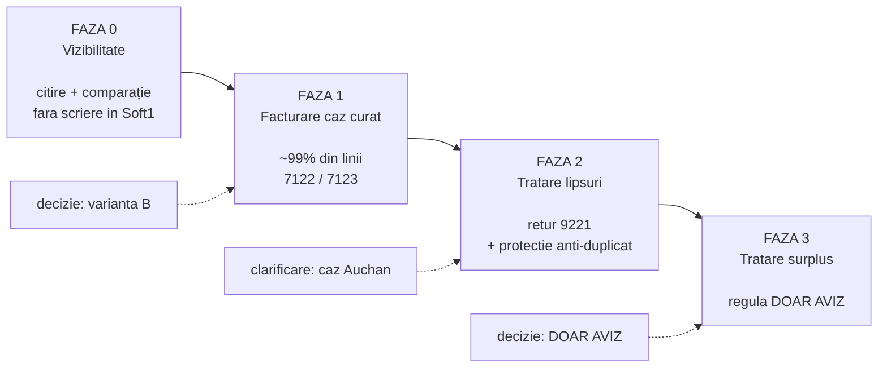

**Subiect:** Recepții EDI Dedeman/Auchan — rezultatul analizei pe date reale și planul propus

Bună ziua,

Am terminat analiza pentru automatizarea recepțiilor EDI. Mai jos e sinteza: ce am verificat, ce am
găsit, ce propunem și ce rămâne de decis sau de corectat la dumneavoastră.

Am pus accent pe verificarea pe date reale, nu doar pe specificație — și a fost util: trei
presupuneri luate din documentație s-au dovedit greșite în producție.

Am inclus și manualul dumneavoastră de retururi, primit între timp: l-am verificat document cu
document în Soft1, iar rezultatul este în §5bis.

---

## 1. Ce am analizat

| Sursă | Volum | Ce am urmărit |
|---|---|---|
| Manualul dumneavoastră de facturare EDI | doc. complet, recitit integral | regulile de business la recepție |
| **Manualul dumneavoastră de retururi** (24.07) | doc. complet | regulile fluxului RETANN |
| Specificațiile Infinite EDInet v4.0 / v4.1 | 2 documente | structura XML RECADV / RETANN |
| **Fișiere RECADV reale de pe FTP** | **101 fișiere, 1.524 linii** (20–28 iul.) | ce sosește efectiv |
| **Fișiere RETANN reale de pe FTP** | **5 fișiere, 15 linii** (20–24 iul.) | fluxul de retururi din magazine |
| Documente Soft1 în producție | 868 avize / 19.203 linii (3 luni)<br>2.251 avize (7 luni) | frecvența diferențelor |
| Istoric retururi Soft1 | tot istoricul, plus 260 facturi 7531 din 2026 | riscuri de duplicare, reguli de retur |
| Nomenclator `CCCS1DXTRDRMTRL` | toate mapările active | ambiguități de cod |

Fișierele RECADV au fost salvate în backup înainte de orice prelucrare. **Nu s-a creat și nu s-a
modificat nimic în Soft1** — toate interogările au fost doar de citire.

---

## 2. Cât de des coincid livrarea și recepția

Am răspuns la întrebare în două feluri independente.

| | **Indirect** (din Soft1, 3 luni) | **Direct** (din RECADV, 8 zile) |
|---|---|---|
| Bază | 868 avize / 19.203 linii | 101 fișiere / 1.485 linii produs |
| Documente/recepții fără diferențe | 84% | 95% |
| **Linii fără diferențe** | **98,8%** | **99,7%** |

Cele două se confirmă reciproc. Fereastra directă e scurtă (8 zile), deci procentul exact e
orientativ — dar tiparul e clar și stabil.

**Rezultatul care contează cel mai mult nu e procentul:**

| Verificare | Rezultat |
|---|---|
| Documente legate automat de avizul lor | **101 din 101** |
| Linii identificate automat în nomenclator | **1.485 din 1.485** |
| Cazuri care ar fi cerut intervenție umană din motive tehnice | **0** |
| Diferențe reale de cantitate | 5 linii |

Cu alte cuvinte: potrivirea automată funcționează. Singurele cazuri care ajung la om sunt diferențele
reale de marfă, nu erorile de sistem.

---

## 3. De ce contează unde punem decizia

Aceleași date, citite la două niveluri diferite:

```
1,2% linii cu diferență   →   16% documente cu diferență
```

Motivul: un aviz Dedeman are în medie ~29 de linii. **O singură** linie stricată face tot documentul
„cu probleme".

| | Varianta A — decizie pe **document** | Varianta B — decizie pe **linie** |
|---|---|---|
| Regula | se facturează automat doar avizele perfect curate | se facturează liniile curate, se marchează doar liniile cu diferență |
| Automatizat | 84% documente | 98,8% linii |
| Ajunge la om | ~139 documente / lună | ~231 linii / lună |
| Muncă manuală reală | ~3.000 linii, din care ~2.770 erau corecte | ~231 linii |

**Varianta B reduce munca manuală de ~13 ori, la același efort de implementare.** În plus, e exact ce
faceți deja azi în Soft1: factura poartă cantitatea acceptată pe toate liniile, iar returul 9221
poartă doar diferența. Nu inventăm un flux nou.

> **Recomandarea noastră: varianta B.**

---

## 4. Ce am aflat din fișierele reale, care nu era în specificație

### 4.1 Cei doi clienți completează același format diferit

| | Dedeman | Auchan |
|---|---|---|
| Fișiere / linii | 78 / 1.304 | 23 / 220 |
| Format | v4.0 | v4.0 (**confirmat**, era o necunoscută) |
| Numărul avizului în RECADV | prezent 78/78 | **absent 0/23** |
| `QuantityOrdered` | mereu gol | mereu completat |
| Legătura cu Soft1 se face prin | număr aviz (+ comandă) | **doar număr comandă** |

Un singur parser e suficient, dar cu așteptări diferite per client.

### 4.2 Câmpuri pe care nu ne putem baza

Absente sau goale în **toate** cele 1.524 de linii primite:

| Câmp | Stare | Consecință |
|---|---|---|
| Preț unitar | absent complet | valoarea liniei se ia din avizul Soft1 |
| Numărul comenzii pe linie | absent complet | antetul e singura referință |
| Cantitate returnată | gol 1.524/1.524 | lipsa se calculează prin comparație cu avizul |
| Motiv neconformitate (text) | gol 1.524/1.524 | **PV-ul nu sosește prin RECADV** |
| Date recepție / comandă / aviz | goale 101/101 | ne bazăm pe datele Soft1 |

### 4.3 Trei presupuneri din specificație, infirmate în producție

| Presupunerea | Realitatea măsurată |
|---|---|
| Fișierele de pe FTP se consumă la citire | **Fals pentru `/recadv`** — 101 înainte, 101 după, verificat de două ori. (Rămâne valabil pentru `/orders`.) |
| Numărul comenzii e obligatoriu pe fiecare linie | **Absent din toate cele 1.524 de linii** |
| Un fișier poate conține mai multe documente | Întotdeauna 1. Însă **mai multe fișiere pot descrie același document** — vezi 4.4 |

### 4.4 Două reguli obligatorii pe care le-am descoperit abia pe date reale

**a) Cantitățile trebuie cumulate per aviz, nu procesate fișier cu fișier.**

```
Aviz AEX-AE-053669, produs 7050533 — livrat 20 buc.

  fișier A  →  16 acceptate     citit separat: "lipsă 4"   ❌
  fișier B  →   4 acceptate     citit separat: "lipsă 16"  ❌
  ─────────────────────────
  cumulat   →  20 acceptate     recepție curată            ✅
```

4 recepții din 101 sunt în această situație. Procesarea fișier cu fișier ar fi generat două retururi
false pentru un singur eveniment fizic.

**b) „Acceptat mai mult decât livrat" trebuie să oprească procesul, nu să genereze retur.**

Există în corpus perechi de fișiere care **nu** sunt livrări parțiale, ci duplicate: același aviz,
același produs, aceeași cantitate, aceeași zi — dar numere de document din familii diferite
(`5017…` și `4600…`). Cumulate, dau 12 bucăți acceptate față de 6 livrate, ceea ce e fizic imposibil.

---

## 5. Riscul cel mai serios pe care l-am găsit: retururi emise de două ori

Am verificat, pentru fiecare aviz + produs, dacă suma retururilor depășește cantitatea livrată.

**Rezultat: 52 de cazuri în tot istoricul, dintre care 16 după 2025-01-01, ultimul pe 2026-06-30.**

Toate cele 16 recente au același tipar: cantitate returnată exact dublă, prin două documente
identice, emise la câteva săptămâni distanță.

| Aviz | Client | Retururi | Cantitate livrată | Returnată | Valoare dublată |
|---|---|---|---|---|---|
| `AEX-AE-048118` | Supeco | `AAEX-PET-2781` + `AAEX-PET-2865` | 1.278 (14 produse) | 2.556 | 1.649,04 lei |
| `AEX-AE-052358` | REWE | `AAEX-PET-3002` + `AAEX-PET-3022` | 6.336 | 12.672 | 5.955,84 lei |
| `AEX-AE-052359` | REWE | `AAEX-PET-3003` + `AAEX-PET-3023` | 6.336 | 12.672 | 5.955,84 lei |

**Total doar pe aceste trei: 13.560,72 lei.**

**Cauza:** Soft1 verifică fiecare retur *individual* față de cantitatea livrată. Fiecare document,
luat separat, este corect. Ce lipsește este scăderea retururilor deja emise. Verificarea trece de
fiecare dată.

Cazurile sunt la Supeco și REWE, nu la Dedeman/Auchan — dar mecanismul e același. **Un sistem automat
ar putea produce astfel de duplicate mult mai repede decât un om**, motiv pentru care faza 2 include
o verificare cumulativă proprie plus o protecție pe identitatea documentului sursă.

---

## 5bis. Al doilea flux: retururile din magazine (RETANN)

Pe lângă confirmările de recepție, retailerii trimit și **anunțuri de retur pentru marfă nevândută sau
expirată**, direct din magazine. Am preluat toate cele 5 fișiere existente.

| Client | Locație | Linii | Cantitate |
|---|---|---|---|
| Dedeman | Depozit 39 On-Line | 4 + 2 | −87, −38 |
| Auchan | Pitești Găvana 043 | 7 | −371 |
| Dedeman | Magazin 71 Bistrița | 1 | −3 |
| Dedeman | Magazin 95 Brașov 2 | 1 | −5 |

### Am primit manualul dumneavoastră de retururi și l-am verificat pe documentele reale

Manualul din 24.07 răspunde la întrebările pe care urma să vi le punem — deci nu le mai punem — și
confirmă regulile pe care le dedusesem independent din date. **Am reconstituit ambele exemple din
manual în Soft1 și se reconciliază la bănuț:**

| Exemplu | Document găsit | Verificare |
|---|---|---|
| Auchan, retur `4497049` | `RFVQ-FC-14864` | 52 × 9,10 + 13 × 7,87 → −638,82 lei cu TVA ✓ |
| Dedeman, retur `6100352505` | `RFVQ-FC-14867` | 1 × 11,03 → −12,24 lei cu TVA ✓ |

Confirmate integral: seria **7531**, comună tuturor clienților; prețul copiat de pe o linie de aviz de
expediție; facturarea pe filiala din câmpul „Transfer către beneficiar", nu pe sediul central;
identificarea produsului pe codul la client, pentru ambii retaileri. Produsele s-au identificat 13 din
13, magazinele 4 din 4.

### Trei reguli din manual nu se potrivesc cu ce face de fapt producția dumneavoastră

Le semnalăm pentru că, implementate literal, ar bloca automatizarea mai mult decât ar ajuta-o.

| Regula din manual | Ce arată datele |
|---|---|
| Prețul vine de pe **ultimul aviz către acea filială** | Niciuna dintre cele 3 linii verificate nu folosește un aviz către filiala care returnează. Returul din Brașov Vest a fost prețuit după avize către *Campus AMBIENT* și *Deva CALAN*; cel din Medias, după un aviz către *Alba Iulia 66*. La Auchan nici nu ar fi posibil — livrăm doar către campusuri și depozite. |
| Este **ultimul** aviz | Nu. Pentru Dedeman existau 6 avize în aceeași zi cu același preț, iar cel ales nu era nici cel mai nou. Determinantă este doar **treapta de preț**. |
| Cantitatea returnată **nu poate depăși** disponibilul de pe avizul-sursă | Regula nu este respectată în practică: din 473 de linii de aviz referite de retururile din 2026, **181 (38%)** sunt folosite de mai multe facturi de retur — una de 44 de ori — iar **127 (27%)** au cantitatea returnată cumulat mai mare decât cantitatea liniei. Cazul extrem: avizul `AEX-AE-048614`, cu 18 bucăți pe linie, este sursa a **499 de bucăți** returnate prin 44 de facturi. |

> **Concluzia noastră:** referința către aviz este o **ancoră de preț**, nu o scădere de stoc. Așa o
> vom trata. Dacă am implementa plafonul din manual, aproximativ un sfert din retururile pe care le
> emiteți azi ar fi respinse automat.

### Singurul lucru care chiar ne blochează

Manualul cere ca factura de retur să poarte, în câmpul `Comanda`, **numărul de ordine de retur**
(Auchan `4497049`, Dedeman `6100352505`). Am confirmat că așa se face azi în Soft1.

**Dar acest număr nu sosește în fișierul pe care îl primim.** Fișierul RETANN conține un singur
identificator — *numărul avizului de retur* Edinet (Dedeman `5017612837`, Auchan `503498`) — adică
exact celălalt număr, pe care manualul dumneavoastră îl definește separat.

Nu e o problemă de unde stocăm valoarea, ci de unde o luăm. Mai ales că exportul existent către
Dedeman validează acest câmp ca obligatoriu, deci fără el pasul rămâne manual chiar dacă tot restul
se automatizează.

| | Întrebarea |
|---|---|
| a | **De unde luăm „numărul de ordine de retur"**, dacă nu vine în fișier? Din portalul EDInet, dintr-un alt document, sau este acceptabil să folosim numărul avizului de retur pe care îl primim? |
| b | **Contează *care* aviz este referențiat** pentru preț, sau doar ca prețul să fie corect? |

Volumul e mic (5 fișiere în 8 zile, față de 101 RECADV), deci nu blochează nimic din planul de mai jos.

---

## 6. Planul pe faze



| Faza | Ce face | Scrie în Soft1 | Efort | Stare |
|---|---|---|---|---|
| **0** | preia RECADV, compară cu avizul, afișează verde/roșu | **nu** | mic | **executată offline 28.07** |
| **1** | facturează automat liniile fără diferență | da | mediu | blocaj tehnic rezolvat 27.07 |
| **2** | generează returul 9221 pentru lipsuri | da | mediu | necesită protecția din §5 |
| **3** | tratează surplusul „DOAR AVIZ" | da | mic | necesită decizia din §7 |

**Despre faza 0:** am executat-o deja, offline, pe cele 101 fișiere. Am putut face asta fără să vă
cerem acordul tocmai pentru că nu scrie nimic — riscul operațional e zero. Nu vă cerem deci
permisiunea să începem, ci **confirmarea că raportul e util în forma actuală**, ca să îl mutăm din
script offline în interfața platformei, rulat automat.

---

## 7. Ce rămâne la dumneavoastră

### 7.1 De verificat sau corectat în date

| # | Problema | Detaliu | Efect dacă rămâne |
|---|---|---|---|
| 1 | **Cod client mapat dublu** | codul Dedeman `7050535` duce la două articole active (`MTRL 34594` și `34294`). Aceeași situație la Carrefour (`112`) și Cora (`334`) | codul actual alege **tăcut** una dintre variante; automatizarea va opri linia pentru validare manuală |
| 2 | **EAN diferit de nomenclator** | 42 de linii au `GTIN` diferit de `MTRL.CODE1` | nu blochează (potrivirea se face pe codul clientului), dar indică date de curățat |
| 3 | **Retururile duplicate din §5** | 52 cazuri, 13.560,72 lei doar pe primele trei | nu am verificat dacă au fost corectate ulterior manual — merită confirmat |

### 7.2 De clarificat cu Auchan / EDInet

| # | Întrebarea | De ce contează |
|---|---|---|
| 4 | Avizul `AEX-AE-053715` are **7.728 buc.** din codul `340171`, dar recepția confirmă **1.392**. Toate avizele Auchan pleacă spre depozite (`901 Campus Auchan AMBIENT`, `51940 CAMPUS Deva CALAN`), nu spre magazinul din recepție | dacă un aviz către depozit deservește mai multe magazine, reconcilierea Auchan trebuie să aștepte **toate** confirmările înainte de a declara o lipsă. Blochează faza 2 pentru Auchan |
| 5 | Ce înseamnă familiile de prefixe din numărul documentului: `5017…`, `4600…`, `2200…`, `1285…` etc. | în cel puțin două cazuri, un `5017…` și un `4600…` descriu **același eveniment fizic**. Fără regulă clară nu putem deduplica sigur |
| 6 | Unde sosesc PV-urile de neconformitate | confirmat că **nu** vin nici prin RECADV, nici prin RETANN. Niciunul dintre cele 106 fișiere analizate nu conține un număr de PV sau un motiv de neconformitate completat |

### 7.3 De decis

| # | Decizia | Termen |
|---|---|---|
| 7 | **Confirmarea variantei B** (decizie la nivel de linie) | înainte de faza 1 |
| 8 | **Regula „DOAR AVIZ"** — vezi mai jos | oricând până la faza 3 |
| 9 | Cine aprobă emiterea automată și ce cazuri se rețin obligatoriu pentru validare umană | înainte de faza 1 |
| 10 | **De unde luăm numărul de ordine de retur** (§5bis) — nu sosește în fișierul RETANN | blochează automatizarea retururilor, nu și fazele 0–3 |
| 11 | Dacă avizul-sursă referențiat pe returul de preț contează în sine (§5bis) | nu blochează nimic |

---

## 8. Decizia „DOAR AVIZ", pe scurt

Nu blochează fazele 0–2. Apare **o dată pe an** (un singur caz în tot istoricul comenzilor EDI).

Cazul real, produs `PF.00006` / cod Dedeman `7050498`, 24 buc.:

| Pas | Document | Preț unitar | Valoare |
|---|---|---|---|
| marfa era deja la CDL, am facturat direct | `AEX-AE-053667` → `FAEXD-PF-39575` | 1,45 lei | 34,80 lei |
| sosește comanda „DOAR AVIZ" `4516747570` | `CKEY-00061000` → `AEX-AE-053708` → `FAEXD-PF-39839` | 1,29 lei | 30,96 lei |
| prima factură stornată | `RFVQ-FC-14935` | | −34,80 lei |

Diferență: **3,84 lei** în favoarea Dedeman. Practic, integrarea comenzii a însemnat refacturare la
prețul retailerului.

> **Întrebarea:** marfa dintr-o comandă „DOAR AVIZ" rămâne facturată la prețul nostru inițial, sau se
> refacturează la prețul din comanda Dedeman?

| Opțiune | Ce presupune | Observație |
|---|---|---|
| A | rămâne la prețul nostru, comanda nu se integrează | manualul spune „nu se integrează *deocamdată*" |
| B | se refacturează la prețul lor, cu storno pe 7531 | azi stornoul depinde de memoria unui om; dacă e uitat, marfa rămâne facturată de două ori |
| **C** | platforma oprește comanda, decide operatorul | **recomandarea noastră** — cazul e rar, elimină riscul din B, și devine oricând A sau B fără muncă suplimentară |

Întrebare legată: cine emite documentul de retur 7531 pentru surplus?

---

## 9. Rezumat

| | |
|---|---|
| **Ce e clar** | formatul, regula de potrivire, ce se poate automatiza și cât — verificat pe date reale, nu presupus |
| **Ce e gata** | faza 0, ca analiză offline: 101/101 documente și 1.485/1.485 linii potrivite automat |
| **Fluxul de retur** | manualul dumneavoastră a fost verificat în producție: ambele exemple se reconciliază la bănuț, dar trei reguli din el sunt contrazise de propriile documente (§5bis) |
| **Ce așteptăm de la dumneavoastră** | confirmarea variantei B (§7.3), clarificarea cazului Auchan (§7.2), verificarea celor 3 puncte de date din §7.1 și sursa numărului de ordine de retur (§5bis) |
| **Ce nu blochează nimic acum** | decizia „DOAR AVIZ" |

Documentația tehnică detaliată (formatul măsurat, regulile de implementare, întrebările deschise) e
în manualul de integrare actualizat, în manualul fluxului de retur și în planul pe faze, toate
atașate.

Rămân la dispoziție pentru orice clarificare.

Cu stimă,
